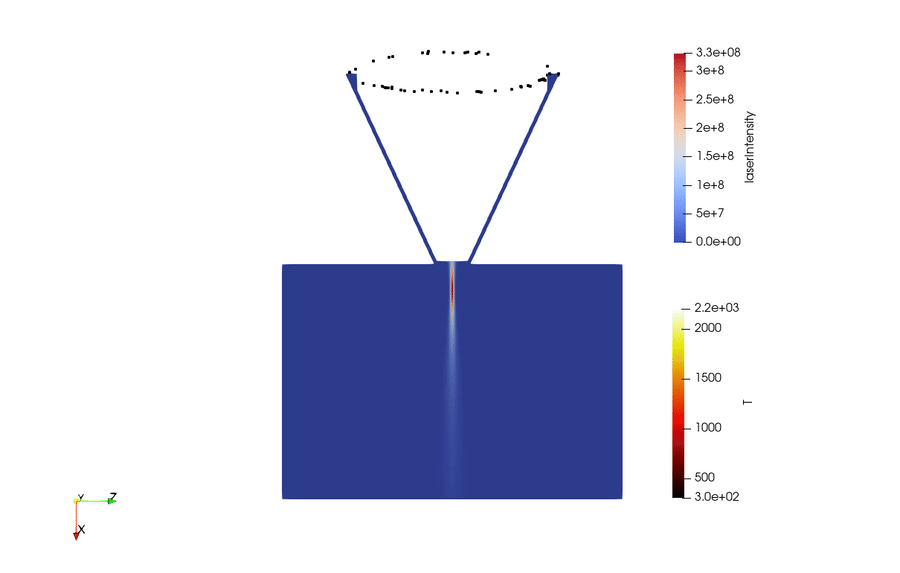
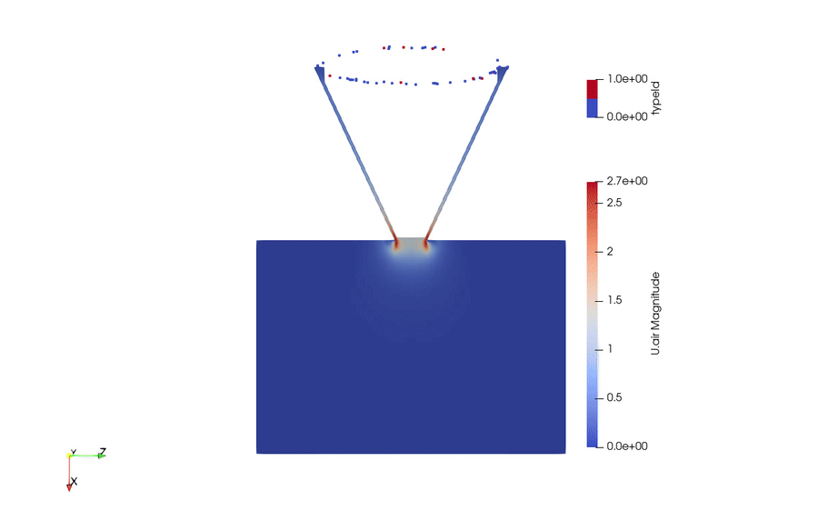

# `LaserDPFoam` solver

## Overview

`LaserDPFoam` is an OpenFOAM solver for simulating gas–particle–laser coupled
flows, with target applications in laser-based additive manufacturing processes
such as Laser Directed Energy Deposition (L-DED) and laser powder-fed coating.

The solver extends the standard `denseParticleFoam` discrete-particle method (DPM) solver
by adding a TEM00 Gaussian laser beam model and a per-particle thermal energy
balance, enabling fully coupled simulation of:

- **Continuous gas phase** (Eulerian): incompressible, turbulence modelling via
  the `DPMIncompressibleTurbulenceModel` framework, PIMPLE pressure-velocity
  loop.
- **Discrete particle cloud** (Lagrangian): kinematic transport with drag
  (Haider–Levenspiel), gravity, and pressure-gradient forces; optional
  inter-particle collisions via `basicKinematicCollidingCloud`; two-way momentum
  coupling (volume displacement + momentum source).
- **Laser heating** (Lagrangian/post-step): TEM00 Gaussian intensity field
  with a focal zone / depth-of-field model; per-particle energy balance
  including laser absorption, Stefan–Boltzmann radiation, and Ranz–Marshall
  forced convection; enthalpy-based phase-change tracking (solid / mushy /
  liquid) with latent heat.

Target applications include:

- Laser Directed Energy Deposition (L-DED)
- Laser powder-fed additive manufacturing
- Laser cladding and surface treatment
- Laser powder-jet characterisation

---

## Physics Summary

### Continuous Phase (Gas)

The gas is treated as a single-phase incompressible fluid with volume fraction

    alphac = max(1 - alpha_p, alphac_min)

Momentum conservation is solved with a two-way coupling source term from the
particle cloud:

    d(alphac * rhoc * Uc)/dt + div(alphac * rhoc * Uc * Uc)
        = -alphac * grad(p) + div(alphac * tau_c) + S_U

where `S_U = -cloudSU.source() / V` is the explicit particle momentum feedback.

### TEM00 Gaussian Laser Beam

Intensity at any point `(x, r)` in cylindrical beam coordinates:

    I(x, r) = (2*P / (pi * Rb(x)^2)) * exp(-2*r^2 / Rb(x)^2)

where `P` is the total beam power and `Rb(x)` is the local 1/e² beam radius.

Beam radius model with flat-focus zone (Depth of Field):

    dist_to_DOF(x) = max(0, xf - DOF/2 - x)       [upstream gap]
                   + max(0, x - xf - DOF/2)        [downstream gap]

    Rb(x) = R0 + dist_to_DOF(x) * tan(theta)

where `R0` is the minimum (focal) beam radius, `xf` is the focal distance,
`DOF` is the depth of field, and `theta` is the convergence/divergence
half-angle.

A moving laser head is supported:

    x_origin(t) = x_initial + v_laser * t

### Per-Particle Thermal Energy Balance

Each particle advances its specific enthalpy `H` by explicit Euler integration:

    m_p * dH/dt = Q_laser - Q_rad - Q_conv

| Term | Expression |
|------|-----------|
| Laser absorption | `Q_laser = alpha_laser * I(xp, rp) * (pi/4 * d^2)` |
| Radiation loss   | `Q_rad = epsilon * sigma_SB * pi*d^2 * (Tp^4 - Tamb^4)` |
| Convective loss  | `Q_conv = h * pi*d^2 * (Tp - Tamb)`,  `Nu = 2 + 0.6 * Rep^0.5 * Prg^(1/3)` |

Phase change (solid / mushy / liquid) is handled via the enthalpy method with
solidus `Tsol` and liquidus `Tliq`, eliminating the singularity in `cp`
across the mushy zone.

### Multi-Material Support

Material properties (absorptivity, emissivity, `cp`, `rhoP`, latent heat,
`Tsol`, `Tliq`) are specified per injector via `injectorProperties`
sub-dictionaries, allowing simultaneous simulation of different powder materials
injected from separate nozzles.

---

## Installation

The `main` branch compiles with **OpenFOAM v2506**.  Install and source a
compatible OpenFOAM environment, then clone and build:

```bash
git clone https://github.com/Y-JIA6/laserDenseParticleFoam.git
cd LaserDPFoam && ./Allwmake
```

The `Allwmake` script first compiles the `DPMTurbulenceModels` library and then
the `LaserDPFoam` executable, which is installed to `$FOAM_APPBIN`.

To clean all build artefacts:

```bash
./Allwclean
```

---

## Required Dictionary: `constant/LaserProperties`

`LaserProperties` is read at run time.  A minimal example:

```
FoamFile
{
    version     2.0;
    format      ascii;
    class       dictionary;
    location    "constant";
    object      LaserProperties;
}

laserDirection          (0 0 -1);      // unit vector along beam axis
laserOrigin             (0 0 0.02);    // beam origin [m]
laserVelocity           (0 0 0);       // laser head velocity [m/s] (0 = static)

laserPower              300;           // total beam power [W]
beamRadiusMin           7.5e-4;        // focal 1/e² radius R0 [m]
halfAngle               0.0646;        // convergence/divergence half-angle [rad]
focalDistance           8.5e-3;        // axial focal point distance [m]
depthOfField            5e-3;          // flat-focus zone length [m]
```

### Particle material properties (`constant/particleProperties`)

Per-injector thermal properties are read from an `injectorProperties` sub-dict:

```
injectorProperties
{
    injector0
    {
        injectorID      0;
        alpha_laser     0.47;      // laser absorptivity [-]
        epsilon         0.1;       // hemispherical emissivity [-]
        cp              421;       // specific heat capacity [J/(kg·K)]
        rhoP            8380;      // particle density [kg/m³]
        Lf              2.92e5;    // latent heat of fusion [J/kg]
        Tsol            1533;      // solidus temperature [K]
        Tliq            1630;      // liquidus temperature [K]
    }
}
```

Global (gas-side) thermal properties are read from the same dictionary:

```
sigma_SB    5.67e-8;    // Stefan-Boltzmann constant [W/(m²·K⁴)]
T_amb       300;        // ambient temperature [K]
k_g         0.016;      // gas thermal conductivity [W/(m·K)]
Pr_g        0.741;      // gas Prandtl number [-]  (Ar)
```

---

## Tutorial Cases

Tutorial cases are located in `00test/`.  Each case includes an `Allrun` script:

```bash
cd 00test/Laser_3D_refer_5gmin
./Allrun
```

The `Allrun` script performs the following steps:

```bash
# Clean and reset the case
cleanCase

# Create the mesh
blockMesh

# Decompose for parallel run
decomposePar

# Run in parallel (e.g. on 10 cores)
mpirun -np 10 LaserDPFoam -parallel
```

### Available Tutorial Cases

| Directory | Description |
|-----------|-------------|
| `Laser_3D_refer_3gmin` | 3-D, 3 g/min powder feed rate |
| `Laser_3D_refer_5gmin` | 3-D, 5 g/min powder feed rate |
| `Laser_3D_Stellite_Inconel_distribution1` | 3-D, Stellite/Inconel multi-material distribution case 1 |
| `Laser_3D_Stellite_Inconel_distribution2` | 3-D, Stellite/Inconel multi-material distribution case 2 |

### Demo Videos

#### Temperature evolution



Video file: [Laser_Tp.ogv](00test/Laser_3D_Stellite_Inconel_distribution1/Laser_Tp.ogv)

#### Velocity/type evolution



Video file: [U_TypId.ogv](00test/Laser_3D_Stellite_Inconel_distribution1/U_TypId.ogv)

---

## Simulation Algorithm Summary

```
Initialise mesh, fields, particle cloud, laser properties

WHILE t < t_end DO

  a. Update Δt for CFL stability
  b. correct continuous-phase transport properties
  c. Evolve particle cloud (positions, velocities, collisions)
  d. Update αc = max(1 − θ_cloud, αc_min)
  e. Compute cloud momentum source  cloudVolSUSu

  PIMPLE loop:
    f.  Assemble and solve Uc momentum equation (UcEqn.H)
    PISO loop:
      g.  Correct face fluxes
      h.  Solve pressure Poisson equation (pEqn.H)
      i.  Correct Uc
    j.  Correct turbulence quantities

  k. Write fields
  l. Compute Eulerian laserIntensity field (LaserAttenuation.H)
  m. Advance per-particle enthalpy / temperature (particleInfo.H)

END WHILE
```

---

## Output Fields

| Field | Type | Description |
|-------|------|-------------|
| `U.<phase>` | `volVectorField` | Continuous-phase velocity |
| `p` | `volScalarField` | Kinematic pressure |
| `laserIntensity` | `volScalarField` | TEM00 Gaussian intensity [W/m²] |
| `kinematicCloud` | Lagrangian | Particle positions, velocities, temperatures |

Particle temperatures are tracked in the persistent `Map<scalar> T_persistent`
(keyed by origProc × 10⁶ + origId) and are exchanged across MPI ranks after
each time step to handle particle migration correctly.

---

## Citation

If you use `LaserDPFoam` in academic work, please cite the associated SSRN
preprint:

- Jia, Yabo, *An open-source and extensible Eulerian--Lagrangian simulation toolkit for modeling laser--gas--powder interactions in laser powder directed energy deposition*.
- Available at SSRN: <https://ssrn.com/abstract=6910409>
- DOI link: <http://dx.doi.org/10.2139/ssrn.6910409>

BibTeX entry:

```bibtex
@misc{LaserDPFoam_ssrn_6910409,
  author       = {Jia, Yabo},
  title        = {An open-source and extensible Eulerian--Lagrangian simulation toolkit for modeling laser--gas--powder interactions in laser powder directed energy deposition},
  howpublished = {SSRN Electronic Journal},
  note         = {Available at SSRN: https://ssrn.com/abstract=6910409 or http://dx.doi.org/10.2139/ssrn.6910409},
  year         = {2026}
}
```

---

## License

OpenFOAM, and by extension the `LaserDPFoam` solver, is licensed free and open
source under the
[GNU General Public Licence version 3](https://www.gnu.org/licenses/gpl-3.0.en.html).

---

## Disclaimer

This offering is not approved or endorsed by OpenCFD Limited, producer and
distributor of the OpenFOAM software via [www.openfoam.com](https://www.openfoam.com/),
and owner of the OPENFOAM® and OpenCFD® trade marks.

**OPENFOAM®** is a registered trademark of OpenCFD Limited, producer and
distributor of the OpenFOAM software via [www.openfoam.com](https://www.openfoam.com/).
